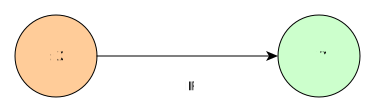
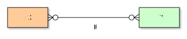

# Neo4j OGM Demonstration

[Neo4jOgmDemo.java](./src/test/java/nu/mine/mosher/neo4j/demo/Neo4jOgmDemo.java)
is a demonstration of using OGM for Neo4j. It is presented as an integration test,
using assertions to demonstrate the effects of various standard operations.

```cypher
(:X)--[:R]->(:Y)
```




`X` and `Y` are `@NodeEntity` classes, and `R` is a `@RelationshipEntity` class.
The relationship is many-to-many:



Operations demonstrated include:

* Create two nodes and a relationship between them
* Read existing nodes and relationships
* Modify properties of a node or relationship
* Delete an existing relationship
* Add a relationship between two existing nodes
* Change one node of an existing relationship
